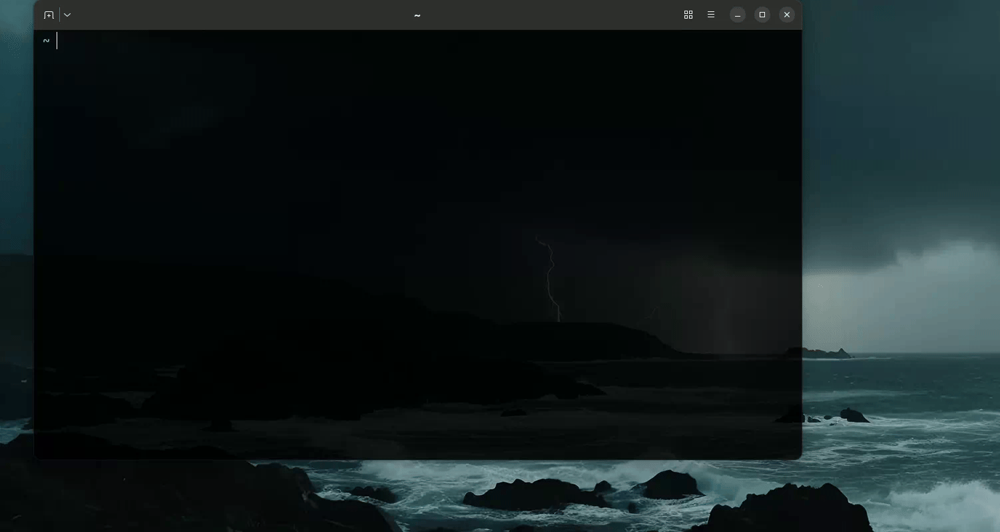

# 🦅 Raven

> *"When you play the algorithm, you win or you get recommended to."*

Raven is a terminal-native YouTube client. You send it a query, it fetches exactly that — no ads, no autoplay, no recommended sidebar, no algorithm deciding what you watch next. You ask, it answers. That's the whole deal.

```
raven Odyssey trailer
```

That's it. That's the interface.

---

## 📺 See it in action

Search, pick, watch — no ads, no autoplay, no algorithm in between.


---

## 🏰 Why send a Raven?

- **It lives in your terminal.** No browser tab, no bookmarks bar, no seventeen other tabs pulling your attention. Just you and what you asked for.
- **No ads. No autoplay. No algorithm.** Raven doesn't know what "engagement" means. It fetches your search, you pick a result, it plays, it ends. Nothing queues up after.
- **Watch only what you came for.** No homepage, no Shorts, no "recommended for you." The absence of a feed is the feature.
- **Built to grow.** Today it's search-and-play. Future versions can extend into offline playlists, a personal audio queue, and more — think of it as the first outpost, not the whole kingdom.

---

## 🗺️ The Known World (supported platforms)

| Platform | Status |
|---|---|
| macOS | ✅ Supported |
| Linux | ✅ Supported |
| Windows | 🔜 Coming in a later version |

Playback currently uses `mpv`. Support for other media players may be added in future versions.

---

## ⚔️ Raising your Raven (installation)

### 1. Install the three ravens you'll need

Raven relies on three battle-tested tools to do the actual work of finding, resolving, and playing video:

**macOS** (via [Homebrew](https://brew.sh)):
```bash
brew install yt-dlp fzf mpv
```

**Linux** (Debian/Ubuntu):
```bash
sudo apt update
sudo apt install fzf mpv
pip install -U yt-dlp
```

**Linux** (Arch):
```bash
sudo pacman -S yt-dlp fzf mpv
```

### 2. Download the Raven binary

Grab the latest release for your platform from the [Releases page](../../releases):

```bash
# macOS (Apple Silicon)
curl -L https://github.com/SainiAdi-04/raven/releases/latest/download/raven-macos-arm -o raven

# macOS (Intel)
curl -L https://github.com/SainiAdi-04/raven/releases/latest/download/raven-macos-intel -o raven

# Linux
curl -L https://github.com/SainiAdi-04/raven/releases/latest/download/raven-linux -o raven
```

### 3. Make it executable and add it to your path

```bash
chmod +x raven
sudo mv raven /usr/local/bin/raven
```

`/usr/local/bin` is on the default `$PATH` for most macOS and Linux shells. If `raven` isn't found after this, check your path with `echo $PATH` and move the binary into any directory listed there instead — or add `/usr/local/bin` to your shell config (`~/.zshrc` or `~/.bashrc`):

```bash
export PATH="/usr/local/bin:$PATH"
```

Then reload your shell:
```bash
source ~/.zshrc   # or ~/.bashrc
```

### 4. Consult the Maester

Before your first flight, make sure everything's in order:

```bash
raven maester
```

This checks that `yt-dlp`, `fzf`, and `mpv` are all reachable, and tells you exactly what to install if anything's missing.



---

## 🦅 Usage

```bash
raven <search query>
```

- A list of results opens in an interactive picker (`fzf`) — search, arrow keys, or type to filter.
- Pick one, and it resolves and plays instantly in `mpv`.
- Press `q` in `mpv` to stop playback.

---

## 🏰 Beyond the Wall (roadmap)

Ideas for future versions — no promises on timing, just the direction:

- Windows support
- Support for media players beyond `mpv`
- Playlist / queue mode — build your own offline-first, ad-free listening queue
- Resume playback from where you left off
- Quality/resolution selection

---

## 🏴 Contributing

This is an early, actively-evolving project. Issues and ideas are welcome — open one on the [Issues page](../../issues).

---

## 📜 License

This project is licensed under the [MIT License](LICENSE).
