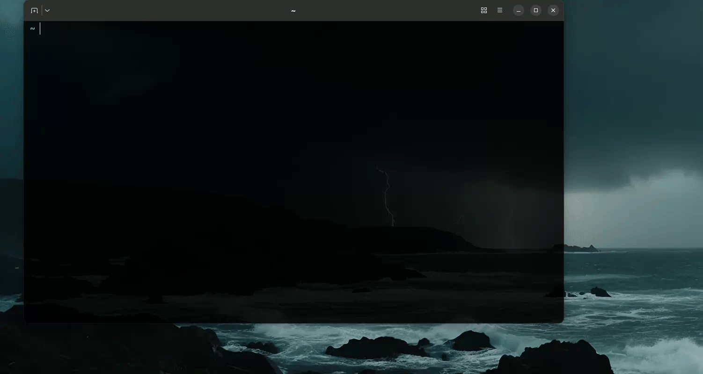

# Raven

Raven is a lightweight, terminal-native YouTube client designed for distraction-free search and media playback. It bypasses web feeds, advertisements, algorithms, and autoplay queues, providing a direct interface to discover and stream content directly from your shell.

```bash
raven Odyssey trailer
```

---

## Demo

Search, select, and stream directly from the terminal without web overhead.


---

## Features

- **Terminal-Native Workflow**: Search and launch media directly from your command line without opening a browser.
- **Sub-Second Hybrid Search**: Queries YouTube's InnerTube API directly (~200ms latency) using native Deno `fetch()`, with automatic fallback to `yt-dlp` for high reliability.
- **Distraction-Free Playback**: No advertisements, algorithmic recommendations, or autoplay queues.
- **Audio Mode**: Stream audio-only with `-a` or `--audio` to suppress video rendering, conserving bandwidth and system resources.
- **Direct Target URL Playback**: Pass standard YouTube watch URLs, short URLs (`youtu.be`), or YouTube Shorts URLs to initiate immediate playback without searching.
- **Interactive Fuzzy Picker**: Filter candidate search results quickly using `fzf` with formatted previews.
- **Environment Diagnostics**: Built-in `maester` command verifies prerequisite external tools (`yt-dlp`, `fzf`, `mpv`) before execution.

---

## Supported Platforms

| Platform | Status |
|---|---|
| macOS | Supported |
| Linux | Supported |
| Windows | Planned |

Playback is powered by `mpv`. Support for additional media players may be introduced in future releases.

---

## Installation

### 1. Prerequisites

Raven delegates media extraction, interactive selection, and stream rendering to three external utilities:

**macOS** (via [Homebrew](https://brew.sh)):
```bash
brew install yt-dlp fzf mpv
```

**Linux** (Debian/Ubuntu):
```bash
sudo apt update
sudo apt install fzf mpv
pip install -U yt-dlp
```

**Linux** (Arch):
```bash
sudo pacman -S yt-dlp fzf mpv
```

### 2. Download Release Binary

Pre-compiled standalone binaries are available from the [Releases page](../../releases):

```bash
# Linux
curl -L https://github.com/SainiAdi-04/raven/releases/latest/download/raven-linux -o raven

# macOS (Apple Silicon)
curl -L https://github.com/SainiAdi-04/raven/releases/latest/download/raven-macos-arm -o raven

# macOS (Intel)
curl -L https://github.com/SainiAdi-04/raven/releases/latest/download/raven-macos-intel -o raven
```

### 3. Install Executable

Make the binary executable and move it into your `$PATH`:

```bash
chmod +x raven
sudo mv raven /usr/local/bin/raven
```

Verify that `/usr/local/bin` is in your shell's `$PATH`. If needed, append it in your shell configuration (`~/.bashrc` or `~/.zshrc`):

```bash
export PATH="/usr/local/bin:$PATH"
source ~/.bashrc  # or source ~/.zshrc
```

### 4. Verify Environment Dependencies

Run the pre-flight verification subsystem to confirm that `yt-dlp`, `fzf`, and `mpv` are properly installed and detected:

```bash
raven maester
```



### 5. Build from Source (Alternative)

If you have [Deno](https://deno.land) installed, you can execute or compile Raven directly:

```bash
# Run in development mode
deno task dev <search query>

# Compile standalone executable
deno task compile
```

---

## Usage

### Interactive Search and Playback

Provide a Search Query to discover YouTube content:

```bash
raven Odyssey trailer
```

1. **Hybrid Search**: Raven queries YouTube's InnerTube API directly (~200ms) with automatic fallback to `yt-dlp`.
2. **Interactive Picker**: Candidate Search Results are displayed in a terminal fuzzy selector (`fzf`). Filter results using arrow keys or typing.
3. **Player Launch**: Upon selection, the Media Stream resolves and begins playback in `mpv`. Press `q` in `mpv` to stop playback.

### Direct Target URL Playback

Provide a specific YouTube watch URL, short URL (`youtu.be`), or YouTube Shorts URL directly to bypass search and picker selection entirely:

```bash
# Standard watch URL
raven https://www.youtube.com/watch?v=dQw4w9WgXcQ

# Short URL
raven youtu.be/dQw4w9WgXcQ

# YouTube Shorts URL
raven https://youtube.com/shorts/dQw4w9WgXcQ
```

Direct Target playback works in combination with Audio Mode:

```bash
raven -a https://youtu.be/dQw4w9WgXcQ
```

### Audio Mode (`-a`, `--audio`)

Enable Audio Mode to suppress video window decoding and display in favor of an audio-only stream (delegated to `mpv` with `--no-video` and optimal audio stream formats):

```bash
# Search and stream audio only
raven -a lofi hip hop

# Long option syntax
raven --audio "deep focus ambient"
```

### Configurable Search Limits (`-n`, `--limit`)

Specify the maximum number of Search Results returned by the search engine (default: `10`):

```bash
# Return up to 20 results
raven -n 20 synthwave mix

# Long option syntax
raven --limit 5 classical piano
```

### Sub-Second Hybrid Search Engine

Raven employs a two-tier search architecture:
- **Primary Engine**: Direct HTTPS queries against YouTube's public InnerTube API (`/youtubei/v1/search`) via native Deno `fetch()`. Search latency is reduced from ~16 seconds to ~200ms with zero extra runtime dependencies.
- **Resilient Fallback**: If an InnerTube request encounters network failures or upstream schema changes, Raven emits a diagnostic notice to `stderr` and falls back to `yt-dlp --flat-playlist`.

---

## Command-Line Reference

### Options

| Option | Description |
|---|---|
| `-a, --audio` | Enable Audio Mode (suppress video display) |
| `-n, --limit <num>` | Maximum number of Search Results (default: `10`) |
| `-h, --help` | Display help message and exit |
| `-v, --version` | Display version information and exit |

### Commands

| Command | Description |
|---|---|
| `maester` | Verify that external dependencies (`yt-dlp`, `fzf`, `mpv`) are installed |

### Examples

| Task | Command |
|---|---|
| Search and select video | `raven Odyssey trailer` |
| Direct Target playback | `raven https://youtu.be/dQw4w9WgXcQ` |
| Stream audio only | `raven -a lofi hip hop` |
| Direct Target in Audio Mode | `raven -a https://youtu.be/dQw4w9WgXcQ` |
| Custom search result limit | `raven -n 20 synthwave mix` |
| Verify system prerequisites | `raven maester` |

---

## Contributing

Contributions, issues, and feature requests are welcome. Feel free to check the [Issues page](../../issues).

---

## License

This project is licensed under the [MIT License](LICENSE).
